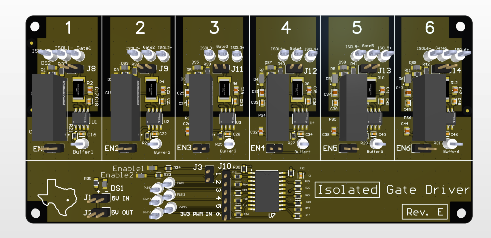
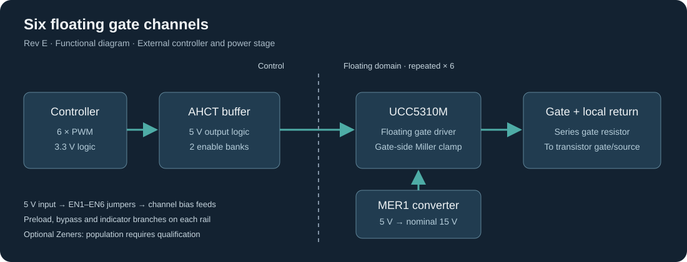
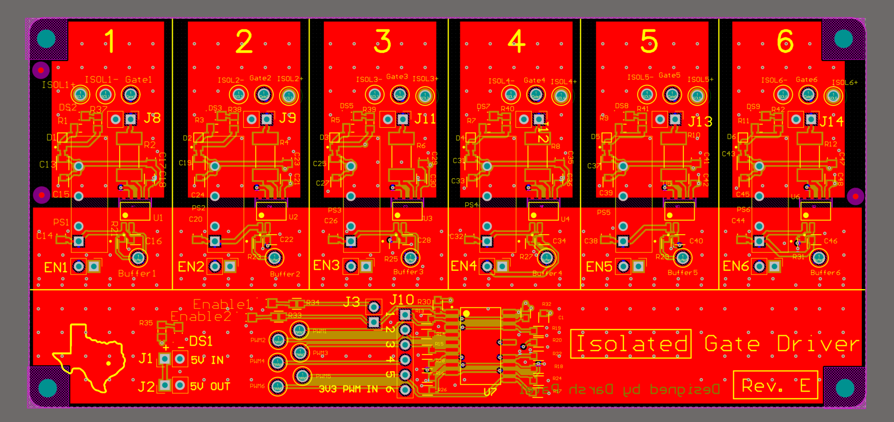

# Six-channel isolated gate driver — Rev E

An Altium PCB for controlling six floating transistor gates from a low-voltage PWM controller. Each channel has its own isolated bias supply and UCC5310M gate driver; a shared AHCT buffer interfaces the PWM logic. Designed by Darsh Patel, with Claude and Codex assisting the design iteration, layout transfer, review and documentation.

*Rev E 3D CAD view. Model markings and catalog values may be placeholders; see the component-selection notes below.*

**This is the saved Rev E design snapshot, not a qualified manufacturing release. Some CAD components were selected only for their footprint, schematic symbol and 3D model. Their displayed values, descriptions and manufacturer part numbers are not necessarily the intended electrical parts. Do not order or assemble directly from the exported CAD BOM.** See [component selection and placeholders](docs/component-selection.md).

## Files

| Path | Contents |
| --- | --- |
| `hardware/isolated-gate-driver.PrjPcb` | Standalone Altium project with local document paths |
| `hardware/Sheet2.SchDoc` | Native schematic, unchanged from the source |
| `hardware/PCB2.PcbDoc` | Native four-layer board, silk marked **Rev. E**, unchanged from the source |
| `hardware/libraries/GPIO_Headers.PcbLib` | Project-local 2.54 mm header footprints and models |
| [Architecture](docs/architecture.md) | Signal path, bias supplies, gate drive and design reasoning |
| [Component selection](docs/component-selection.md) | Explicit placeholder examples and commissioning selections |
| [Opening the design](docs/opening-the-design.md) | Altium version, library links and export workflow |
| [Revision and validation](docs/revision-and-validation.md) | What was checked, historical evidence and remaining work |
| [Source manifest](docs/source-manifest.json) | Source-relative paths, modification dates and SHA-256 hashes |
| [Placed footprints](docs/placed-footprints.csv) | Actual footprint names and positions from the saved PCB |

## Status

The snapshot was packaged October 8, 2026. The board was saved October 7; the schematic was saved October 3. There are 152 unique schematic designators and 155 PCB component records, including three PCB fiducials. Original design binaries are preserved byte-for-byte. Only the project wrapper was adjusted to remove external file paths and references to omitted generated outputs.

October 3 routing/DRC results predate Rev E's October 7 edits and do not certify this snapshot. No fresh Altium compile, ECO comparison, repour, DRC or bench qualification was performed for this publication. Old fabrication ZIPs are deliberately excluded; regenerate outputs from the reviewed final design. No complete order-ready Rev E BOM is supplied.

## Purpose

The board separates a controller's PWM commands from six independently referenced gate circuits. It can support experiments with different bridge configurations without putting a processor on the driver board. The external controller and power stage remain responsible for PWM sequencing, dead time, current protection and fault shutdown. Transistor choice, bus voltage, gate charge and switching frequency determine the actual operating envelope.

*User-supplied Altium copper view, showing six channel columns and the shared PWM interface. This image is documentation, not a DRC or isolation qualification report.*

The use of isolated driver ICs does not establish an assembled-board safety isolation or working-voltage rating. The converter, PCB stackup, copper spacing, connectors and test arrangement must all meet the intended application. Refer to the [validation record](docs/revision-and-validation.md) before using the design.

## License and attribution

The original circuit/layout contributions and documentation are released under the [MIT license](LICENSE). This grant does not relicense vendor CAD content embedded in the native files. The converted KiCad header library retains its upstream license; see [third-party notices](THIRD_PARTY_NOTICES.md). Manufacturer names identify the parts and do not imply endorsement. AI assistance is documented as development provenance, not evidence of electrical validation.
